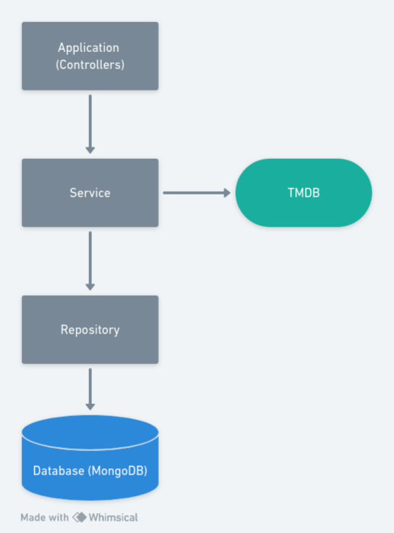
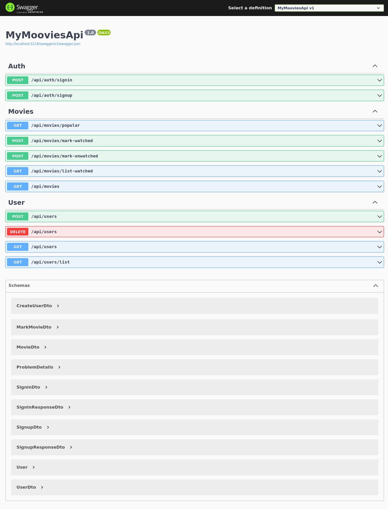

# MyMoovies API

#### This is a project for learning purposes

This project is a personal movie tracker API built using dotnet C#. The API uses a N-Layer architecture, MongoDB as the database and Swagger for API documentation and testing.

The application use the [The Movie Database API (TMDB)](https://developer.themoviedb.org/docs/getting-started) to fetch the movies.

## Architecture

## Features

- Authentication (JWT)
- Users can create a new account
- Users can see a list with popular movies
- Users can mark movies watched
- Users can see a list with movies marked as watched
- Users can search for movies (in progress)
- Users can see details of movies

## Technologies

- C#
- dotnet 7
- MongoDB
- Docker

## Demo

